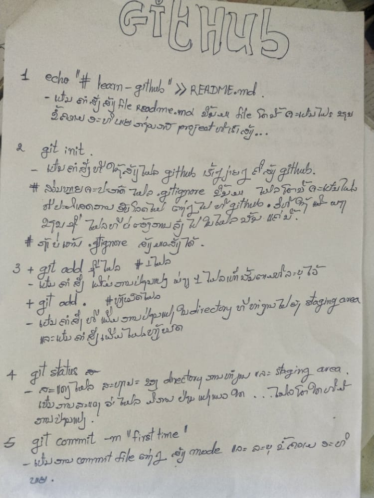
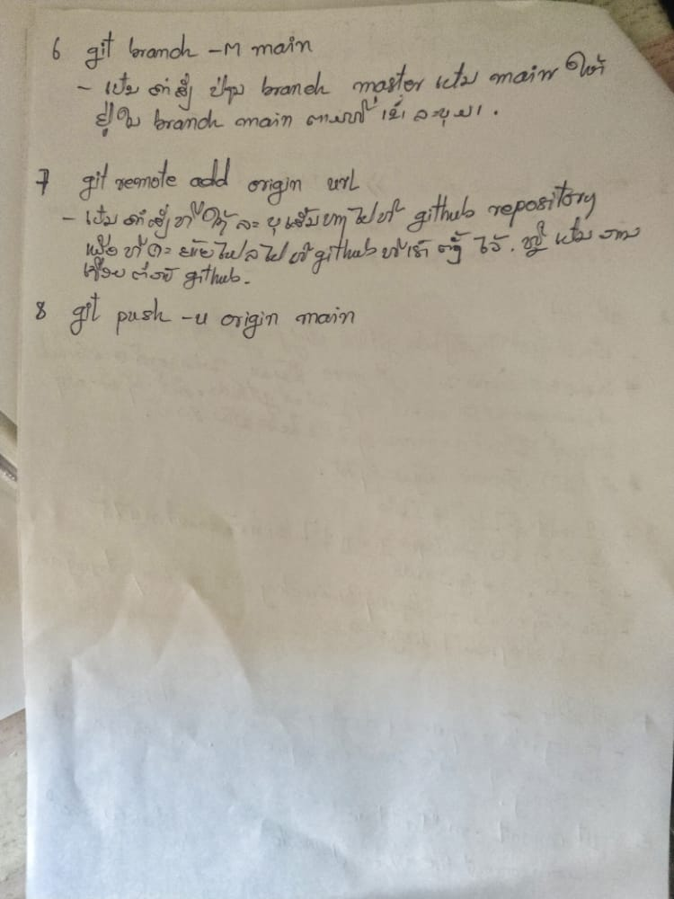

# learn-github
this is the thing I just try to use the github how is it ? wowww it's so cool
i like it so much i can help me a lots
 
how to use git command  

# Clone this repository
$ git clone https://github.com/Sengkue/simplefolio

# Go into the repository
$ cd simplefolio

# Remove current origin repository
$ git remote remove origin

-----------+++++++++++++------------------+++++++++++++++++++------------

nuj sua cov explain github
<h2>
1. git init //uas kom nws paub tias yog nyob rau hauv repository 
  
2. git status //saib seb muaj file dab tsis nyob rau hauv repository 
  
3. U //untracked file xwb
  
4. git add nrog npe file //txhawm rau ua kom file nws khag mus nyob rau hauv repository 
  
5. A //yog add mus rau hauv repository lawm tab mas nws tseem tsis tau khag mus nyob rau hauv repository
  
6. git commit -m "qob quav" //yog commit kom file nws nkag mus nyob rau repository 
  
7. git log //yog saib seb muaj dad tsis uas commit mus rau hauv repository 
  
8. M //yog muaj kev modified file lawm 
  
9. git add . //yog add txhawm rau ua kom file mus rau hauv repository tab mas yog tag nrog txhuas tus file
  
10. git clean -n //yog siab seb muaj file dad tsis nyob rau status U  
11. git clean -df //yog deleted file uas nyob status U  
12. git log //yog saib seb muaj dad tsis nyob rau hauv kev commit //muaj tus lej commit lis 10 tus copy lo  
13. git reset --hard nrog cov lej copy los //ces file zoo lis haum tsis tau modified lawm  
14. git branch //yog saib seb muaj branch dad tsis nyob rau hauv yus lis repository  
15. git branch nrog lub npe //yog tsim branch tshiab  
16. git branch --delete nrog lub npe branch // yog deleted branch pov tseg  
17. git checkout nrog lub npe branch //yog move branch  
18. kev tsim branch yog ib qhos zoo rau kev uas yus yuav coj mus develop //yog tias yus tsim branch tshiab los  
es yus move branch los rau es txhawm rau kev sim yog tsis zoo ces yus tsis yuav ces yus hos move rov qab mus  
rau branch qub ces yuav rov qab zoo lis qub nws yog ib qhos zo heev  
19. git merge nrog lub npe branch //yog sum file uas nyob rau hauv branch tshiab uas yus sim tsim los  
20. tsim file uas yog .gitignore los ces hauv gitignore sauv tus file los sis fonder uas yus tsis xav rub mus rau hauv re
pository   
21. muaj .gitignore add mus rau hauv yus lis repository kom repository nws paub tias tus file los sis fonder twg yus t
sis xav rub mus rau repository    
22. kev push yus lis project mus rau tom github yog yus yuav tsum msu tsim repository tom github ua ntej 
ces copy URL los     
23. git remote -v //yog saib seb yus lis project puas connect nrog repository qhov twg      
24. git remote add origin nrog URL uas copy los //yog uas kom yus lis projec connect rau repository tom github       
25. git push origin master //yog yus push yus lis project mus rau tom github  
26. git pull origin master //yog rub file tom github los seb muaj leej twg los kho los sis paum yus lis file tom github  
27. git clone nrog URL //yog rub poject tom github los  
 
los ntawm tus tij laus nos nawb ntawm cov ntaub ntawv no =="olanlab"   

</h2>
